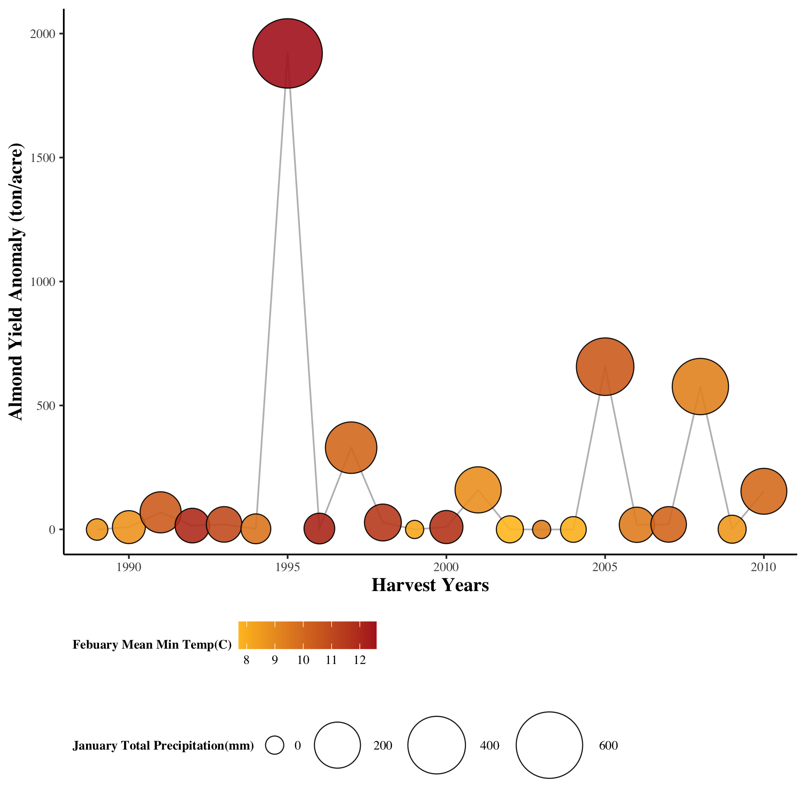

```{r setup, include=FALSE}
knitr::opts_chunk$set(echo = TRUE)
```



`r table.1`

### Summary of Findings:

Changes in temperature and precipitation caused by climate change have the potential to negatively impact agricultural yields of perennial crops like almonds. To understand the impact of these climate factors on almond yields, Lobell et al. (2006) developed statistical models that calculate almond yield anomaly as a function of mean February minimum temperature (in ºC) and total January precipitation (in mm). Using that equation in a function in R, the almond yield anomaly was calculated for sample climate data from 1988 to 2010. The results are shown in the table and figure above. Almond yield anomaly tends to be the largest in years where the total January precipitation is highest. Each of the peaks in almond yield anomaly occur when January precipitation is at least 200mm, and the greatest yield anomaly (1919.98 tons/acre) occurs in 1995, the year with the greatest precipitation (676.51 mm). Mean February minimum temperature also impacts almond yield anomaly, but not as much as precipitation does. Generally, lower temperatures result in smaller almond yield anomalies, as nearly all the 7-8 ºC temperatures result in anomalies around 0 tons/acre. Higher mean February minimum temperatures may result in greater almond yield anomalies, but 1996 shows that high temperatures may result in low yields if there is little precipitation. These results will be important in predicting how climate change may affect future almond yields in California.

### End Assignment 2
